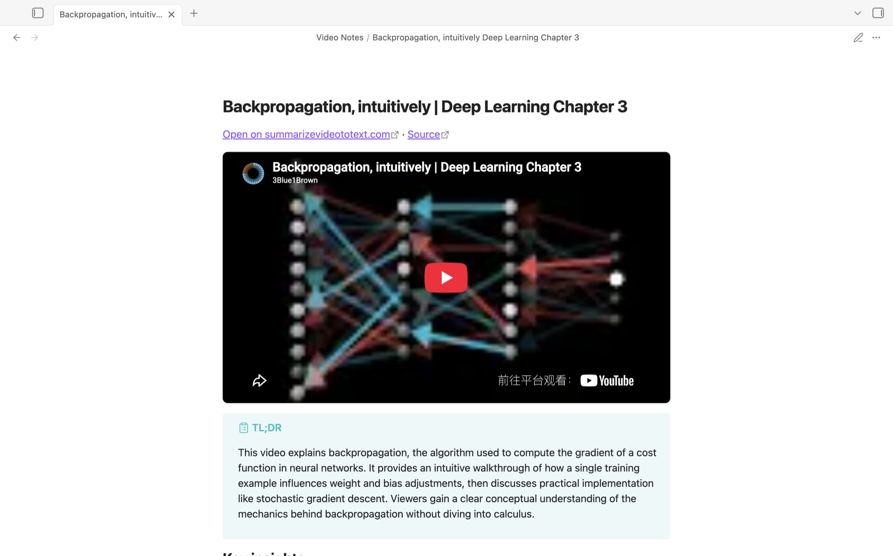
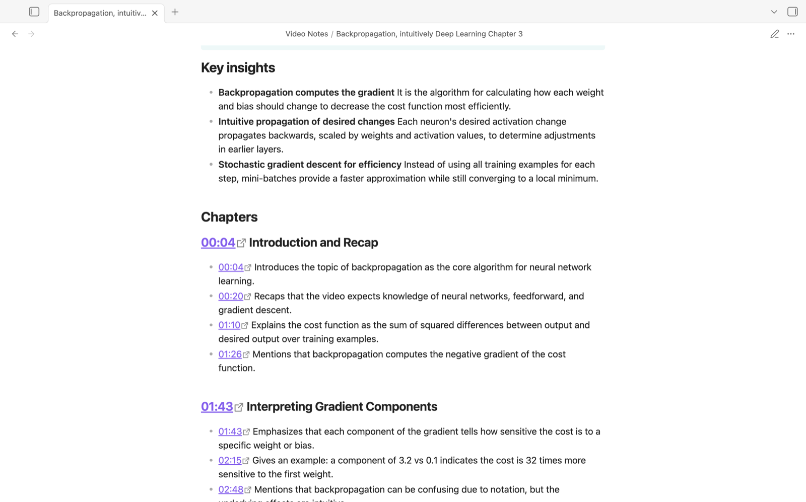
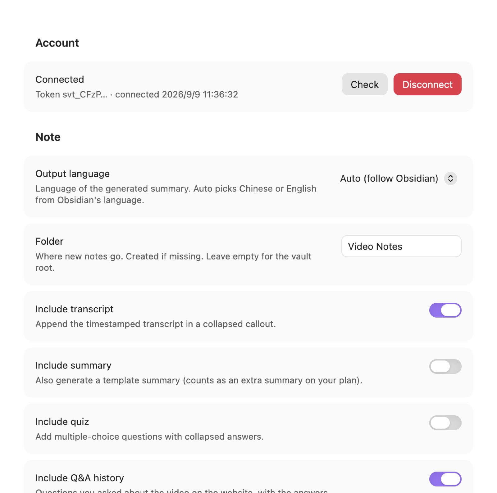
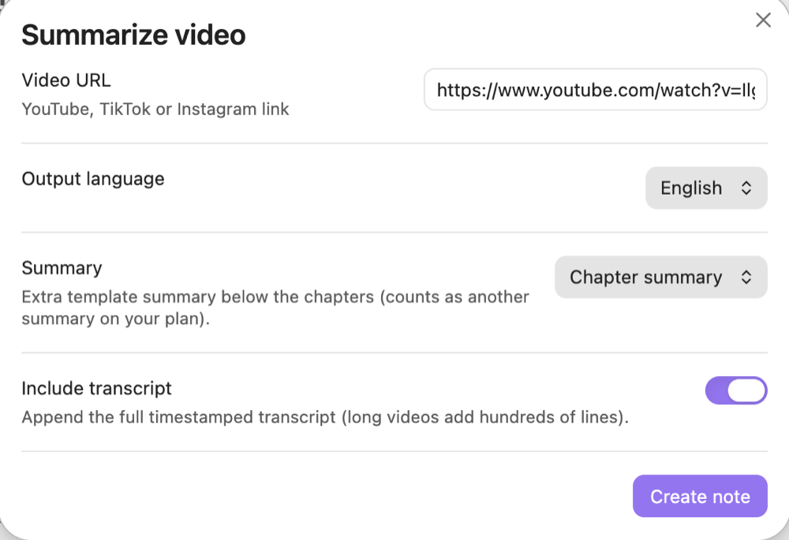
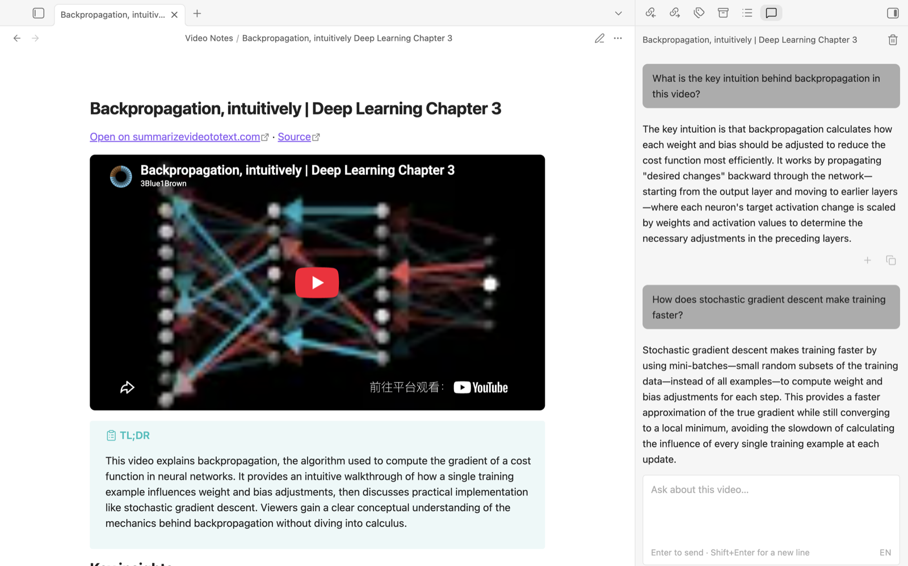

# Summarize Video To Text — Obsidian plugin

Turn a YouTube, TikTok or Instagram video into a structured Obsidian note in one command:



- **TL;DR** callout and **key insights**
- **Embedded player** (YouTube and TikTok) at the top of the note; timestamp links seek it in place
- **Chapters** with timestamped bullet points (with the player off, a timestamp opens the video's page on summarizevideototext.com at that second)
- Optional **summary** in one of several templates (bullet, table, chapter digest, …)
- Optional **quiz** with collapsed answers
- Optional **transcript** in a collapsed callout
- A link back to the video's page on summarizevideototext.com (player, Q&A, quiz, progress) plus the original source link
- Frontmatter with title, source, workspace link, channel, language and tags — ready for Dataview



Everything is generated by [summarizevideototext.com](https://summarizevideototext.com); the note Markdown itself comes from the site's export endpoint, so the website's *Export → Obsidian* button and this plugin produce the same note. The plugin stores no model keys and sends nothing but the video link and your account token to that service.

## Before you install

- **Account required.** The plugin only works with a summarizevideototext.com account. A free account covers a daily allowance of videos; longer videos, unlimited use and the quiz section are part of the paid Pro plan ([pricing](https://summarizevideototext.com/pricing)).
- **Network use.** Every command sends the video link, your output-language choice and your account token to `https://summarizevideototext.com` (or the server URL you set). The video is fetched and analysed there; nothing is processed locally and no other service is contacted. See the site's [privacy policy](https://summarizevideototext.com/privacy) and [terms](https://summarizevideototext.com/terms).
- **No telemetry.** The plugin itself collects nothing; the server keeps ordinary request logs for the calls above.

## Setup

1. Install the plugin and enable it.
2. Open **Settings → Summarize Video To Text** and click **Connect**. Your browser opens the website; sign in (Google, or create a free account) and it will send you back to Obsidian.
3. If the browser can't open Obsidian, copy the token shown on the website and paste it into the **Or paste a token** field.



Free accounts get a daily allowance of summaries; Pro removes the daily cap. See the [pricing page](https://summarizevideototext.com/pricing).

## Usage

- **Command palette → Summarize video from URL**: paste a link (the clipboard is pre-filled if it holds a link). The dialog lets you pick the output language and an optional summary template for this note only.

  

- **Right-click a link** in the editor or in reading view → **Summarize video**.
- **Select a link in a note → Summarize video link in selection** (no dialog, uses your settings).
- Or click the video icon in the ribbon.
- **From the website**: on any video page, *Export → Obsidian* sends the note straight into this plugin (no re-analysis).
- **Open video chat**: a right-sidebar panel to ask questions about the note you're reading. It uses the note's generated section as context, keeps the conversation per video (same history as the website's Q&A tab), and **Add to note** appends an answer under your own notes.

  

- **Refresh video note**: re-fetch the generated part of the current note (new quiz results, Q&A, progress). Everything outside the `%% svt:start %%` / `%% svt:end %%` markers, and any frontmatter keys you added, is kept.

Chat answers use the summary quota of your plan like a question asked on the website.

Notes are created in the folder you choose (default `Video Notes`) and opened automatically.

## Settings

| Setting | What it does |
| --- | --- |
| Output language | Language of the summary. *Auto* follows Obsidian's language (Chinese or English). |
| Folder | Destination folder, created if missing. |
| Include transcript | Append the timestamped transcript (collapsed). |
| Include summary | Also request a template summary. Counts as an extra summary on your plan. |
| Include quiz | Add multiple-choice questions with collapsed answers (Pro). |
| Include Q&A history | Add the questions you asked about the video on the website. |
| Embed video player | YouTube and TikTok: put a `svt-video` block (rendered as a player) at the top instead of the thumbnail. Clicking a timestamp seeks the player. With the player off, YouTube timestamps open the browser at that second; TikTok links open the video from the start (TikTok has no seek parameter). Instagram and uploads keep the thumbnail. |
| Open note after creating | Self-explanatory. |
| Server URL | Advanced. Only change to test a preview deployment. |
| Preview bypass secret | Advanced. Vercel *Protection Bypass for Automation* secret, only needed for a protected preview server. |

## Privacy and network use

- The plugin talks only to the server URL in settings (default `https://summarizevideototext.com`).
- It sends the video link, your chosen language and your account token. Video content is fetched and processed server-side.
- Your token is stored in this vault's `.obsidian/plugins/summarize-video-to-text/data.json`. If you sync or share the vault, treat that file as a secret; you can revoke tokens any time at **summarizevideototext.com/connect/obsidian**.

## Development

```bash
npm install
npm run dev          # watch build → main.js (debug channel)
npm run build:debug  # one-off debug build
npm test             # vitest: note merging, player helpers, SSE parsing
npm run build        # release: typecheck + minified main.js
```

Build channels: `dev` and `build:debug` produce a **debug** build whose default server is the preview site `https://pre.summarizevideototext.com`; `build` produces the **release** build pointing at `https://summarizevideototext.com`. The channel and default are shown under *Settings → Advanced*. The preview site sits behind Vercel Deployment Protection, so a debug build also needs the *Preview bypass secret* setting (never commit it).

Copy `main.js`, `manifest.json` and `styles.css` into `<vault>/.obsidian/plugins/summarize-video-to-text/` to test locally.

The website's connect page lives at `/connect/obsidian` and returns to Obsidian via the `obsidian://svt-connect?token=…&state=…` protocol. The `state` is generated by the plugin and checked on return, so a stray link can't inject a token.

## License

MIT
